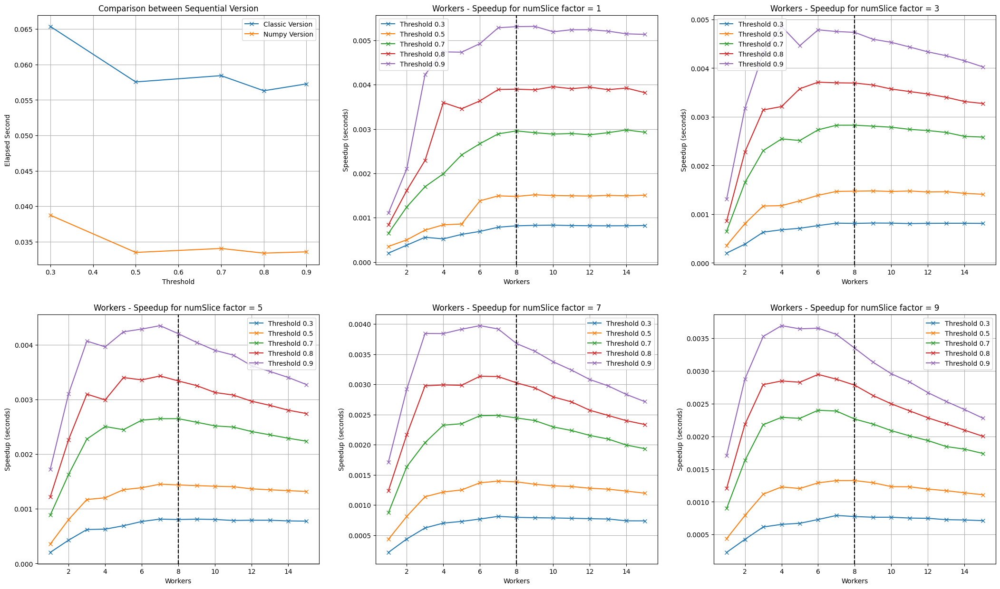

# All-Pairs-Docs-Similarity
Given a set of documents and the minimum required similarity threshold find the number of document pairs that exceed the threshold

## Requisites
```console
sudo apt install default-jre
```

```console
pip install beir
pip install pandas
pip install sklearn
pip install -U pip setuptools wheel
pip install -U spacy
python -m spacy download en_core_web_sm
pip install ipywidgets
```

## PySpark Local Installation
```console
wget https://dlcdn.apache.org/spark/spark-3.4.0/spark-3.4.0-bin-hadoop3.tgz
sha512sum spark-3.4.0-bin-hadoop3.tgz
tar -xzf spark-3.4.0-bin-hadoop3.tgz
```

## Configure Spark Environment
Follow this [tutorial](https://phoenixnap.com/kb/install-spark-on-ubuntu) 

## Used Dataset
[nfcorpus](https://www.cl.uni-heidelberg.de/statnlpgroup/nfcorpus/)


## Start Application
Enter in the *app* folder and run
```console
python main.py
```

## Results
